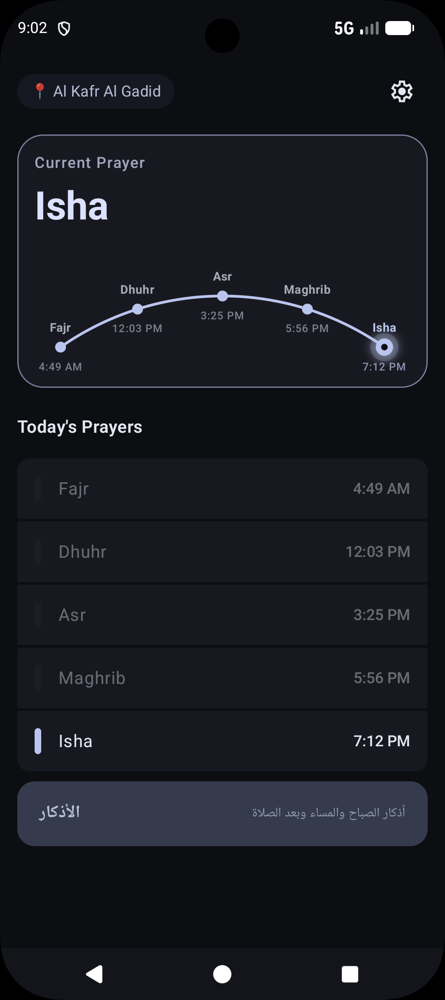
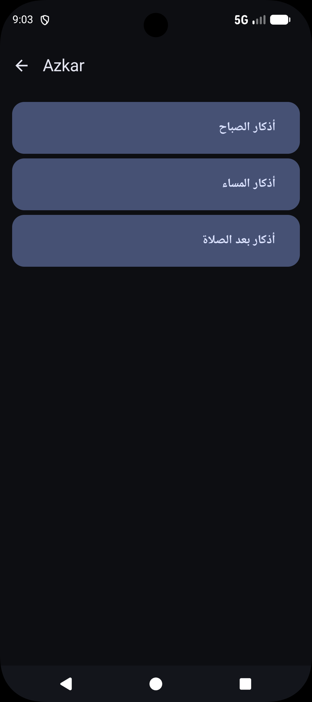
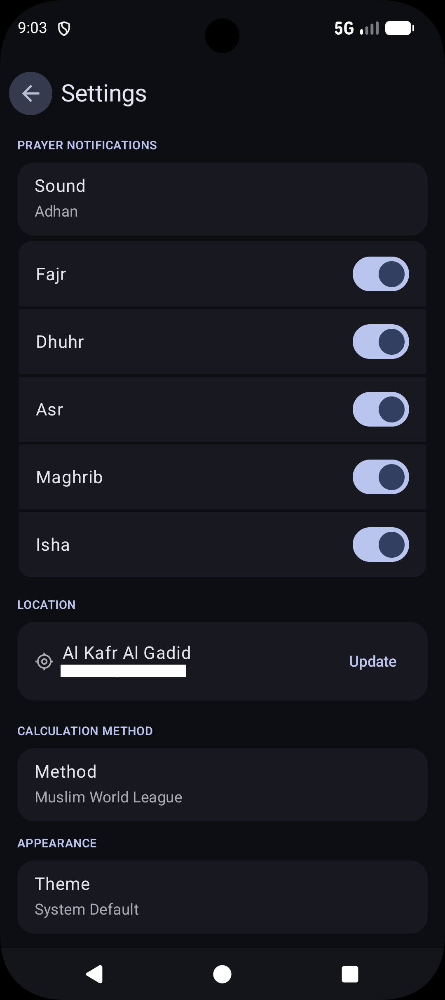

# مواقيت — Mawaqit

A clean, modern Islamic companion app for Android built with Kotlin and Jetpack Compose.

---

## Features

### 🕌 Prayer Times
- Accurate prayer time calculation using the **Adhan** library (Hafs, multiple calculation methods)
- Real-time countdown to the next prayer
- Beautiful **arc stepper** that animates continuously between prayers throughout the day
- Automatic daily scheduling via **WorkManager**
- Exact alarm support with battery optimization handling

### 📿 Azan
- Azan playback via a **foreground MediaPlayer service** at the exact prayer time
- Separate Fajr azan support
- Smart screen detection — silent notification if the user is already active on their device
- Volume key and audio focus handling to stop playback naturally
- Respects per-prayer notification preferences

### 📖 Quran Reader *(in progress)*
- Full **Madinah Mushaf** (Hafs 'an 'Asim) — 604 pages rendered as high-quality WebP images
- Horizontal swipe navigation mimicking a real Mushaf
- Surah index with page ranges for all 114 surahs
- Last-read page persistence
- Bookmark support

### 🌙 Azkar
- Morning, Evening, and After-Prayer azkar
- Full Arabic text with repeat count and reward (fadl) for each zikr
- RTL-native layout throughout

### ⚙️ Settings & Onboarding
- Guided onboarding flow covering location, notifications, exact alarms, and battery optimization
- GPS-based location with manual fallback
- Per-prayer notification and sound preferences
- Light / Dark / System theme support

---

## Tech Stack

| Layer | Technology |
|---|---|
| Language | Kotlin |
| UI | Jetpack Compose + Material 3 |
| Navigation | Navigation3 (Nav3) |
| Prayer Calculation | adhan-kotlin (KMP) |
| Persistence | DataStore Preferences |
| Background Work | WorkManager |
| Date & Time | kotlinx.datetime |
| Serialization | kotlinx.serialization |
| Image Loading | Coil |
| Minimum SDK | 26 (Android 8.0) |

---

## Architecture

The app follows a unidirectional data flow pattern with a clear separation of concerns:

- **Repository layer** — DataStore-backed repositories for settings, location, and Quran state
- **ViewModel layer** — exposes `StateFlow` to the UI; no business logic in composables
- **Composable layer** — stateless where possible, lifecycle-aware effects for tickers and foreground detection
- **Service layer** — foreground `MediaSessionCompat` service for azan playback with proper audio focus management

---

## Screenshots

|  |  |  |  |  |  | 

---

## Getting Started

1. Clone the repo
2. Open in Android Studio Hedgehog or newer
3. Sync Gradle and run on a device or emulator (API 26+)

---

## License

This project is for personal and educational use.