# مواقيت — Mawaqit

A clean, modern Islamic companion app for Android built with Kotlin and Jetpack Compose.

---

## Features

### 🕌 Prayer Times & Azan
- **Accurate Calculation**: Uses the **Adhan** library with support for multiple calculation methods (Hafs, MWL, ISNA, etc.).
- **Visual Progress**: A beautiful **arc stepper** that animates continuously between prayers throughout the day.
- **Full-Screen Azan**: Azan playback via a full-screen notification at the exact prayer time, including separate Fajr azan support.
- **Smart Notifications**: Intelligent screen detection to avoid loud azans if the user is already active on their device.
- **Daily Scheduling**: Automatic daily scheduling via **WorkManager** to ensure reliability.

### 📖 Quran Reader
- **Advanced Search**: Support for full Ayah and Surah search.
- **Rich Interaction**: Tap any Ayah for a bottom sheet offering:
  - **Tafsir**: Multiple tafsir sources (Tafsir al-Jalalayn, etc.) viewable side-by-side with the Ayah.
  - **Recitation**: Per-ayah playback with a wide selection of world-class reciters.
  - **Management**: Copy, share, or bookmark specific verses.
- **Customization**: Detailed reading settings for font size, font style, and translation visibility.
- **Offline Ready**: Download entire surah recitations for listening without an internet connection.

### 📿 Azkar & Radio
- **Categorized Azkar**: Morning, Evening, and After-Prayer azkar with RTL-native layout.
- **Counter Support**: Visual repeat counts and rewards (fadl) for each zikr.
- **Live Radio**: Stream a variety of Islamic radio stations directly within the app using a persistent global player.

### 🌙 Onboarding & Settings
- **Guided Onboarding**: A comprehensive flow to set up:
  - **Location**: Auto-fetching via IP/GPS with manual fallback.
  - **Permissions**: Intelligent handling of Location, Notification, Exact Alarm, and Battery Optimization permissions, including redirection to settings for permanently denied states.
  - **Initial Preferences**: Set calculation methods and themes from the start.
- **Theming**: Full support for Light, Dark, and System themes using Material 3.

---

## Tech Stack

| Layer              | Technology                   |
|--------------------|------------------------------|
| Language           | Kotlin                       |
| UI                 | Jetpack Compose + Material 3 |
| Navigation         | Navigation3 (Nav3)           |
| Prayer Calculation | adhan-kotlin (KMP)           |
| Persistence        | DataStore Preferences + Room |
| Background Work    | WorkManager                  |
| Date & Time        | kotlinx.datetime             |
| Serialization      | kotlinx.serialization        |
| Minimum SDK        | 29 (Android 9.0)             |

---

## Screenshots

### Main Experience
| | | |
|:---:|:---:|:---:|
| 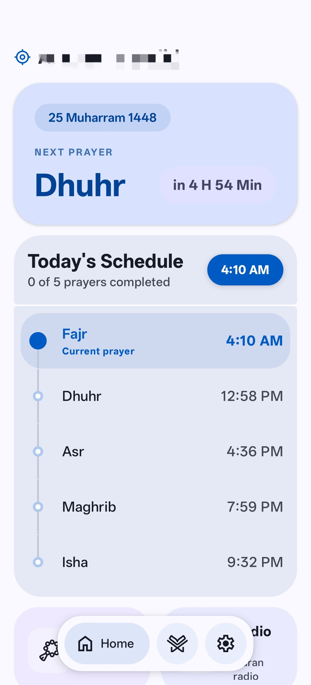 | 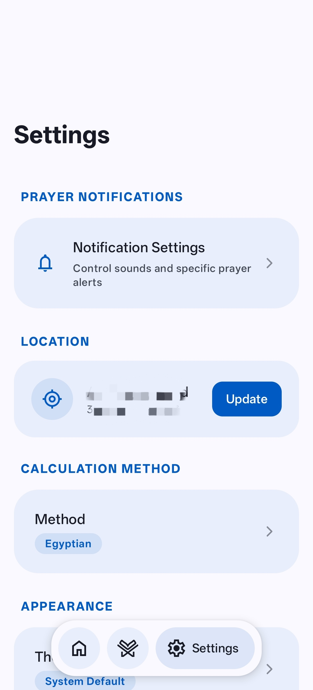 | 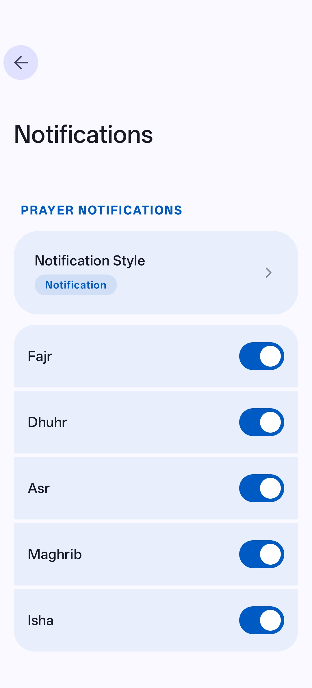 |

### Quran & Reading
| | | | |
|:---:|:---:|:---:|:---:|
| 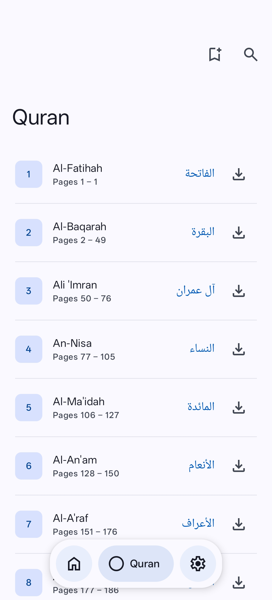 | 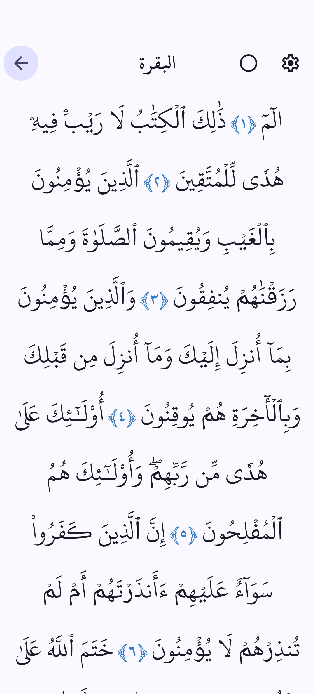 | 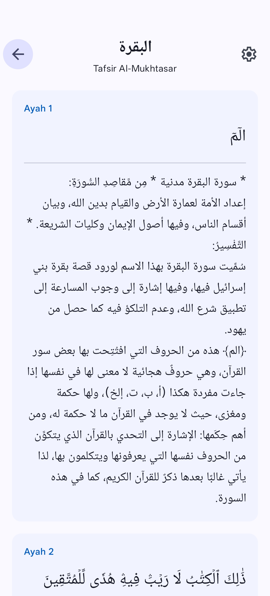 | 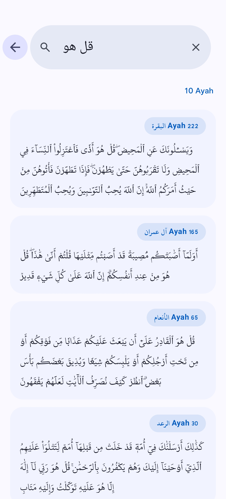 |

### Features & Tools
| | | | |
|:---:|:---:|:---:|:---:|
| 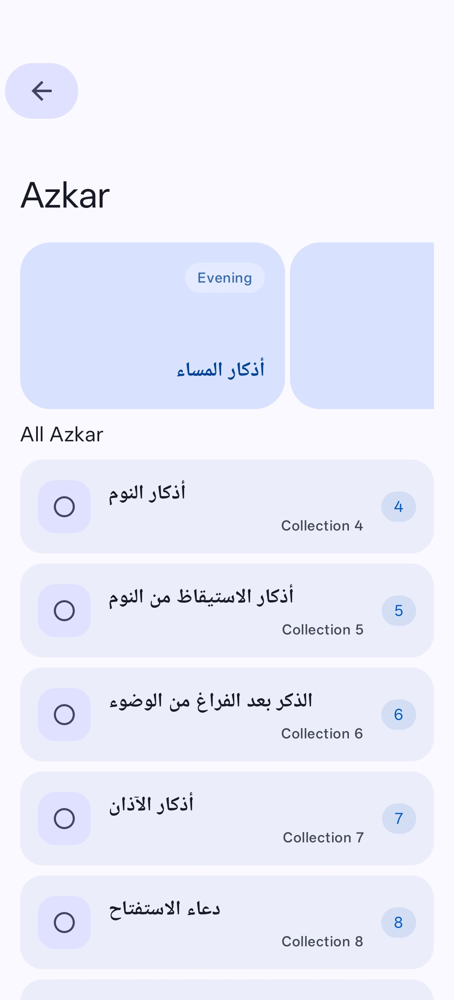 | 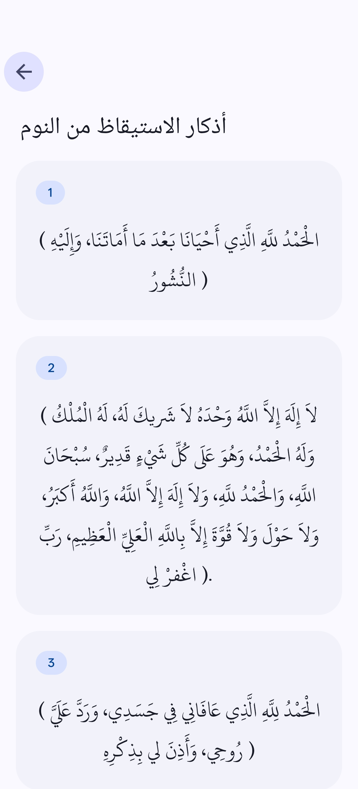 | 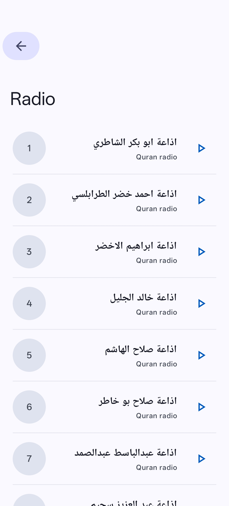 | 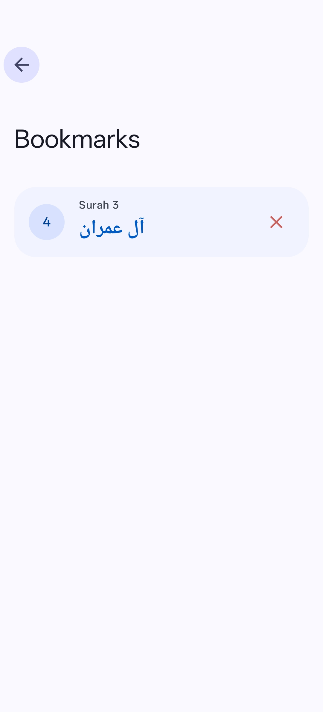 |

### Interactive UI
| | | | |
|:---:|:---:|:---:|:---:|
| 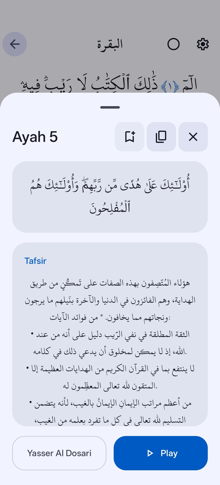 | 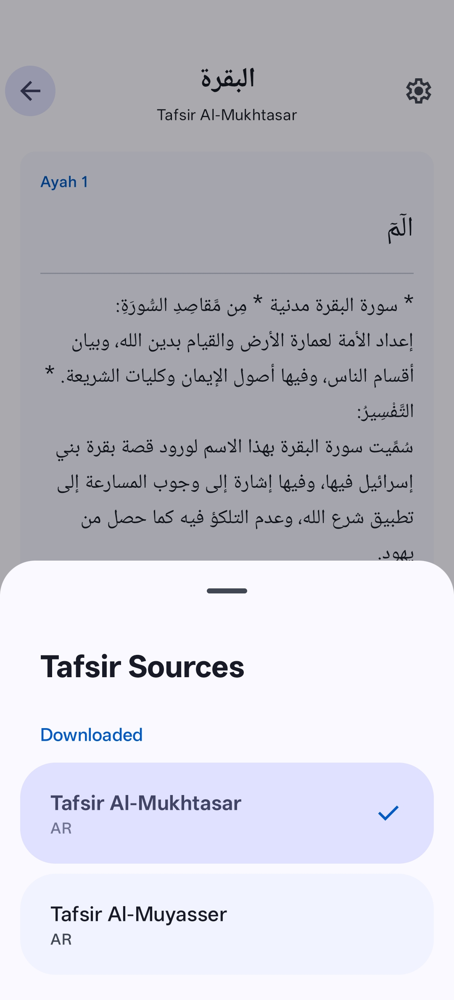 | 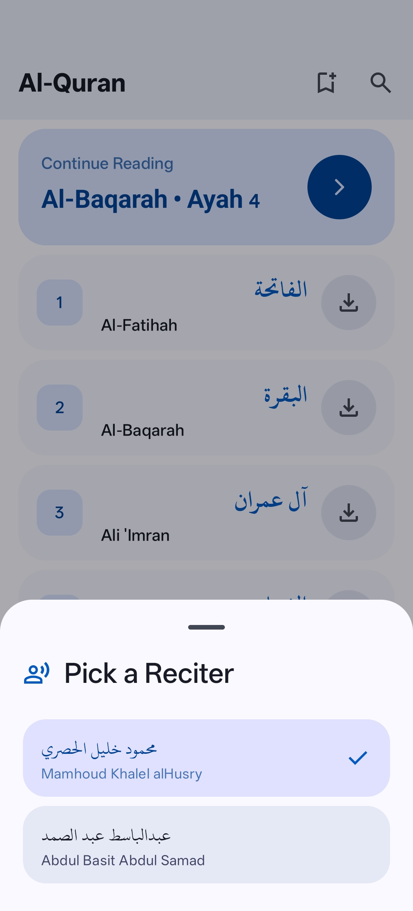 | 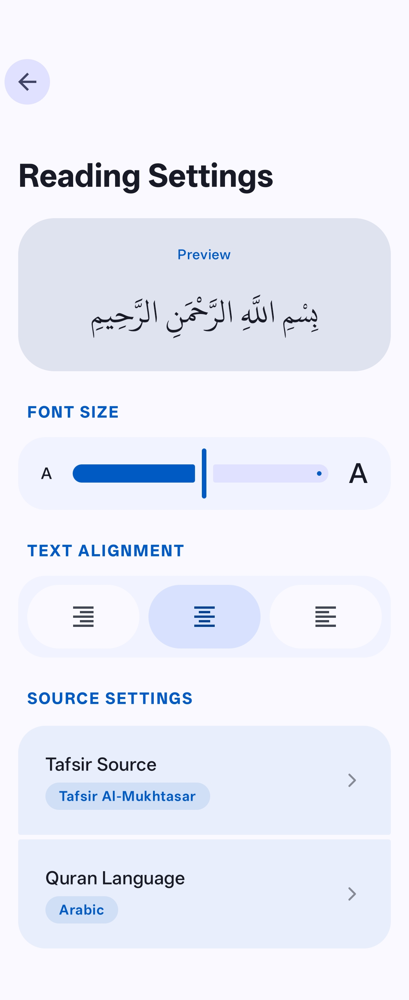 |

### Onboarding Flow
| | | | | |
|:---:|:---:|:---:|:---:|:---:|
|  |  |  |  | 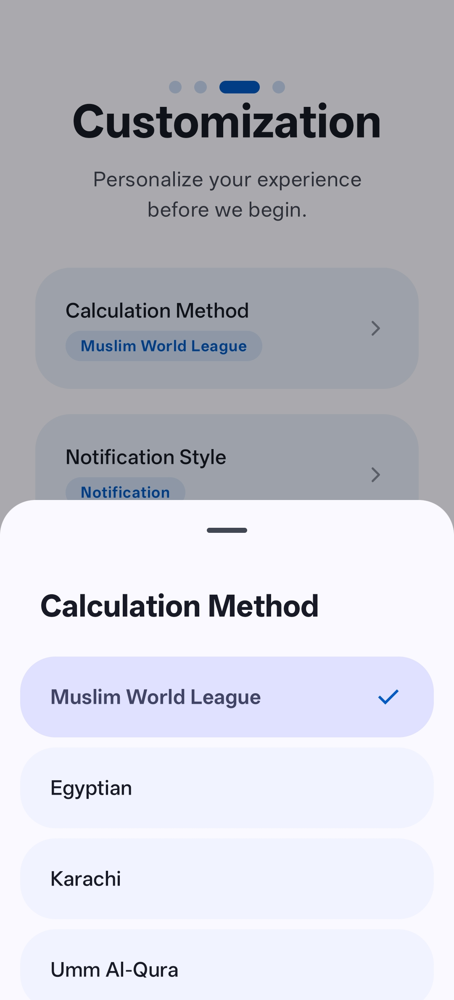 |

---

## Getting Started

1. Clone the repo.
2. Open in Android Studio Hedgehog or newer.
3. Sync Gradle and run on a device or emulator (API 29+).

---

## License

This project is for personal and educational use.
