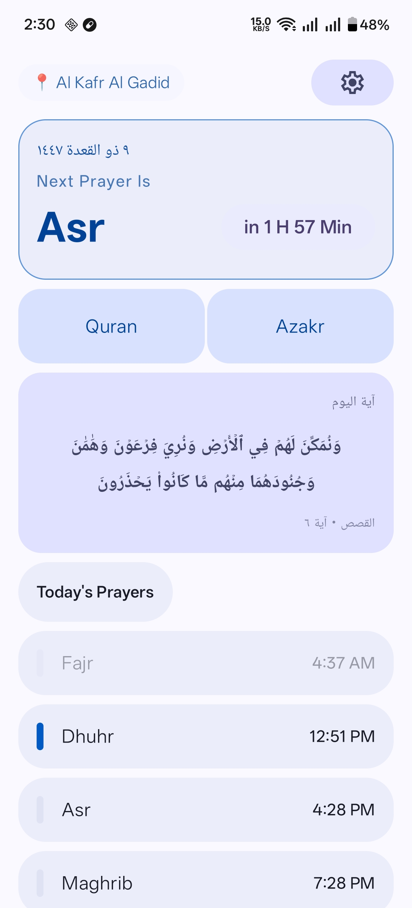
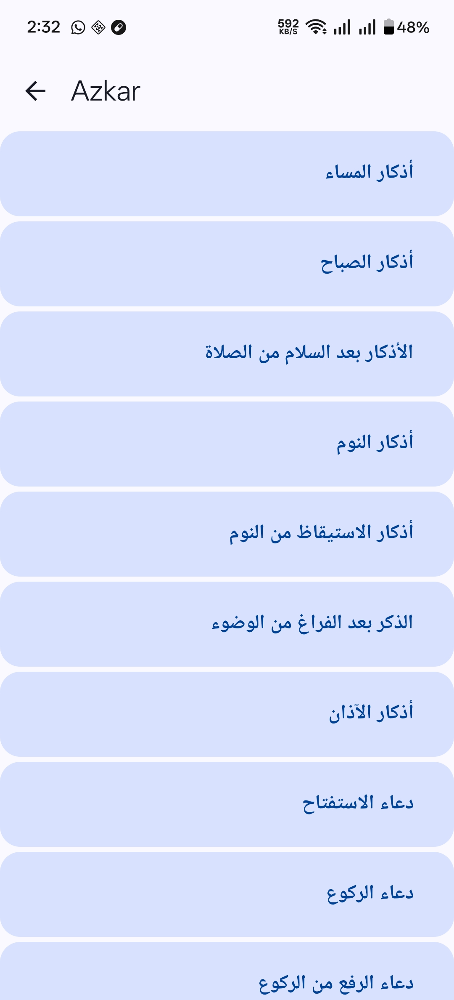
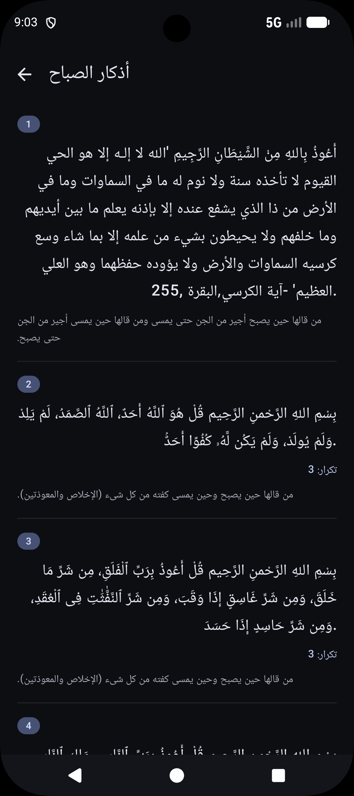
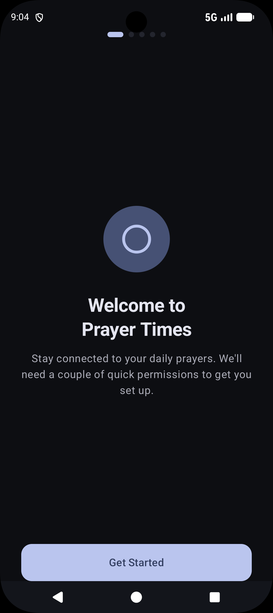
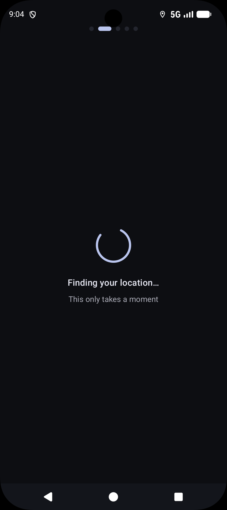
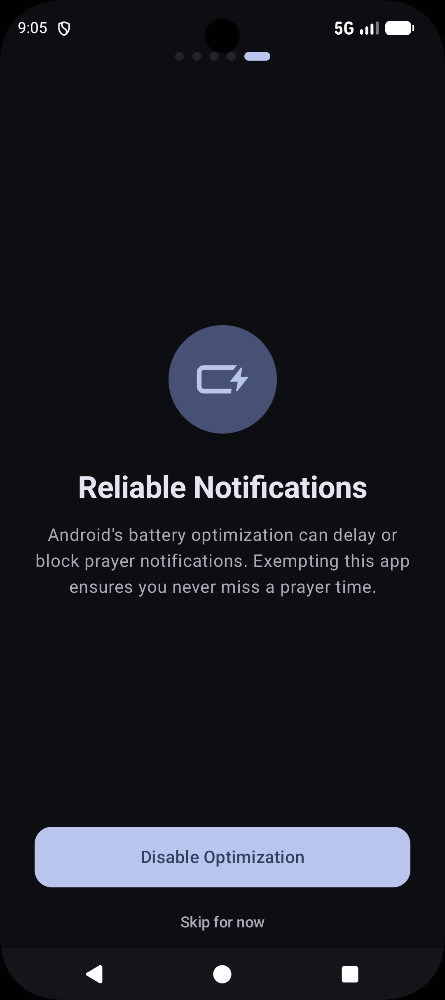
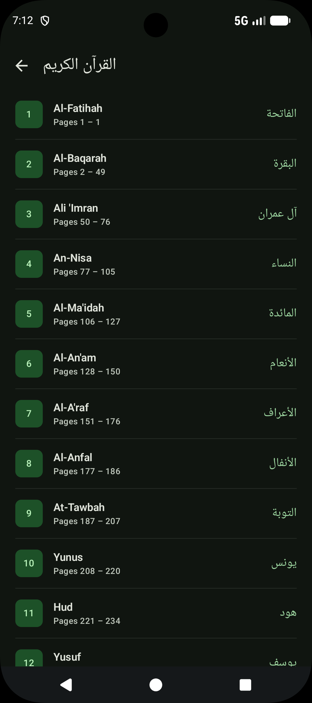
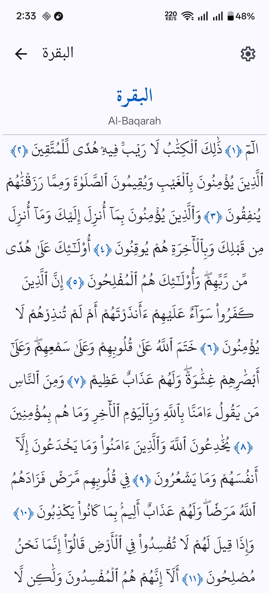
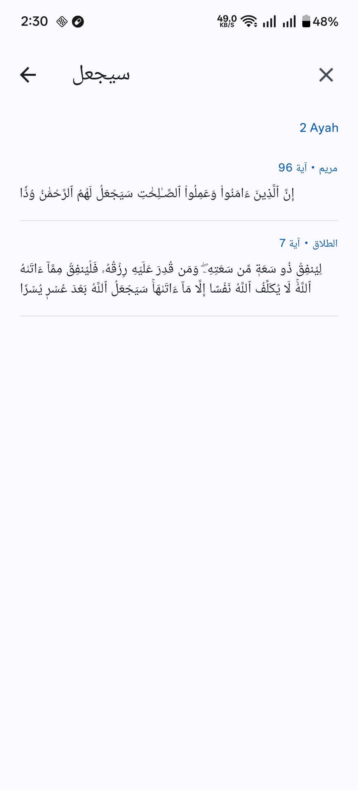
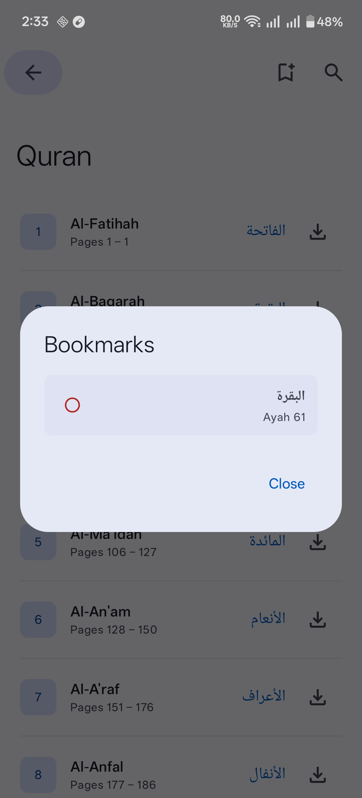

# مواقيت — Mawaqit

A clean, modern Islamic companion app for Android built with Kotlin and Jetpack Compose.

---

## Features

### 🕌 Prayer Times

- Accurate prayer time calculation using the **Adhan** library (Hafs, multiple calculation methods)
- Real-time countdown to the next prayer
- Beautiful **arc stepper** that animates continuously between prayers throughout the day
- Automatic daily scheduling via **WorkManager**
- Exact alarm support with battery optimization handling

### 📿 Azan

- Azan playback via a **Full screen notification** at the exact prayer time
- Separate Fajr azan support
- Smart screen detection — silent notification if the user is already active on their device
- Respects per-prayer notification preferences

### 📖 Quran Reader

- Full Ayah and surah search support
- Per ayah tafisr and recitation support with multiple reciters
- Bookmark support
- Full surah recitation with download support

### 🌙 Azkar

- Morning, Evening, and After-Prayer azkar
- Full Arabic text with repeat count and reward (fadl) for each zikr
- RTL-native layout throughout

### ⚙️ Settings & Onboarding

- Guided onboarding flow covering location, notifications, exact alarms, and battery optimization
- GPS-based location with manual fallback
- Per-prayer notification and sound preferences
- Light / Dark / System theme support

---

## Tech Stack

| Layer              | Technology                   |
|--------------------|------------------------------|
| Language           | Kotlin                       |
| UI                 | Jetpack Compose + Material 3 |
| Navigation         | Navigation3 (Nav3)           |
| Prayer Calculation | adhan-kotlin (KMP)           |
| Persistence        | DataStore Preferences        |
| Background Work    | WorkManager                  |
| Date & Time        | kotlinx.datetime             |
| Serialization      | kotlinx.serialization        |
| Cache              | Room database                |
| Minimum SDK        | 29 (Android 9.0)             |

---

## Screenshots

   |  |  |  |  |  |  |  |  |  | 

---

## Getting Started

1. Clone the repo
2. Open in Android Studio Hedgehog or newer
3. Sync Gradle and run on a device or emulator (API 26+)

---

## License

This project is for personal and educational use.